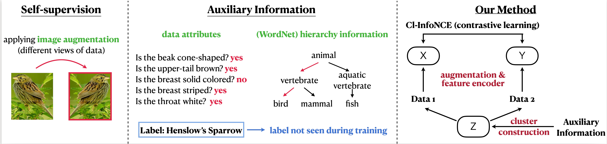

# Cl-InfoNCE
This repo contains official pytorch implementation for Cl-InfoNCE. Cl-InfoNCE can incorporate different level of supervision into contrastive pretraining. 



## Pre-requisite
An Anaconda Environment file `requirements.txt` is provided for environment installation.


## Dataset Configuration
Download the dataset from the link provided in the paper supplementary and link the dataset file into the dataset_processing folder in the following way:

```
data_processing
├── CUB
|    ├── rank_H      (provided)
|    └── images      (unzip from CUB-200-2011)
├── Wider
|    ├── rank_H      (provided)
|    ├── train       (unzip from Wider Attribute)
|    ├── val         (unzip from Wider Attribute)
|    └── test        (unzip from Wider Attribute)
├── UT-Zappos50K
|    ├── rank_H      (provided)
|    └── ut-zap50k-images-square  (unzip from UT-Zappos50K)
├── imagenet100
│   ├── hier         (provided)
|   ├── kmeans       (provided)
|   ├── train        (unzip from ILSVRC-2012)
│   └── val          (unzip from ILSVRC-2012)
```
`rank_H` is the content of `--instruction rank_H` flag, which contains `meta_data_train.csv` and `meta_data_val.csv` instrucitons files for different level of auxiliary information used for Cl-InfoNCE. 


## Pretraining using Cl-InfoNCE

### Kmeans + Cl-InfoNCE
Here, we use imagenet-100 as an example. To run Cl-InfoNCE with Kmeans clustering, use the following bash script on 4-GPU machines:
```
cd scripts
bash run_clinfonce_kmeans.sh 0,1,2,3
```


### Auxiliary information + Cl-InfoNCE
Here, we use imagenet-100 as an example. To run on the 4-GPU machines with level 12 auxililary information + Cl-InfoNCE:
```
cd scripts
bash run_clinfonce.sh level_12 0,1,2,3
```
## Linear Evaluation
After pretrianing, use `run_eval.sh` to perform linear evulation protocal. Suppose the model is saved in <ckpt_path>, then run the following to see the linear evaluation performance:

```
bash run_eval.sh <ckpt_path> 
```


## Citation

